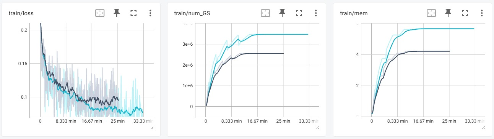
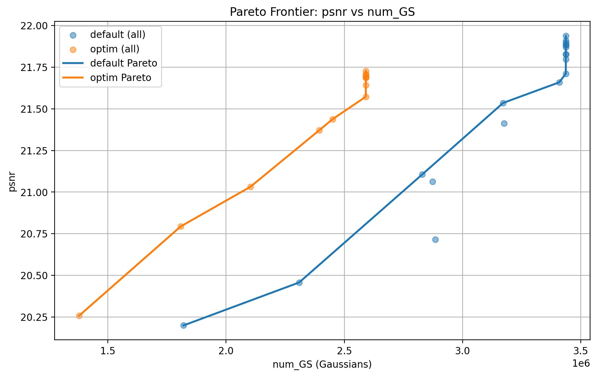
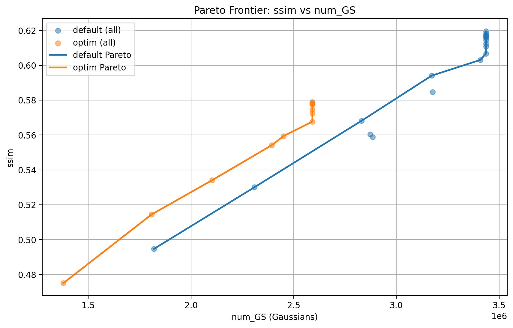
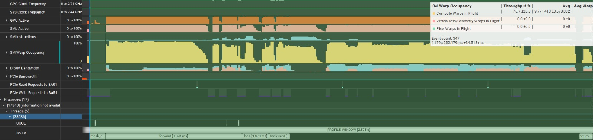

# Adaptive Tile-Level Gradient Masking for 3D Gaussian Splatting

We present a modification to the 3D Gaussian Splatting (3DGS) training loop (in Gsplat) that dynamically skips backward-pass computation over well-converged $16\times16$ pixel tiles. The goal is to cut per-step training cost by not spending compute on image regions that have already converged and by extension reducing the total gaussian count leading to a smaller PLY filesize and faster rendering.

This repository contains the implementation and an empirical analysis of our work. Our finding is that while our initial results look very promising: a per-step cost reduction (36% wall-clock, 48% backward pass) and scene compression: (26% reduction in file size), Our method comes at a huge cost as it *considerably degrades* quality because it fights against the Adapative Density Control Densification strategy. Using the MCMC densification strategy however avoids that, but our time wins are minimized considerably. Still, our method under MCMC densification leads to faster convergence (6% faster on average). which is an improvement, despite being a far cry from our initial results.

---

## Motivation

The standard 3DGS training loop applies a uniform photometric loss (a weighted combination of L1 and SSIM) across **every pixel of every training image at every iteration**. This uniformity is wasteful:

- Well-reconstructed regions accumulate near-zero gradients yet still consume the same rasterization time, backward-pass computation, and optimizer bandwidth as high-error regions.
- As training progresses and more of the scene converges, the same views are revisited thousands of times, and an increasing fraction of tiles contribute negligible gradient signal.

The 3DGS rasterizer already gives us a natural granularity to exploit this. Each $16\times16$ tile is processed independently by a CUDA thread block, and the **per-tile photometric error is computed for free during the forward pass** which is a direct indicator of per-region convergence. Tiles with near-zero loss have already been well-reconstructed and contribute little to parameter updates, so suppressing their backward pass is a natural candidate for reducing cost without proportionally sacrificing image quality.

## Method

We introduce **adaptive tile-level gradient masking**, which suppresses backward-pass computation over converged tiles based on a per-image tile error map maintained via an exponential moving average (EMA) cache. A **progressive percentile schedule** gradually increases masking selectivity over 30,000 steps, letting global structure form freely early in training before concentrating compute on persistently difficult regions.

The training loop alternates between two step types:

- **Refresh step:** Full render → compute error map → update EMA cache → train with uniform loss.
- **Masked step:** Load cached EMA tile errors → build mask → masked render → weighted loss → train.

Our method consists of three components:

1. **Per-image EMA tile-error cache** decouples error *measurement* (expensive, amortized over refresh steps) from mask *application* (every intermediate step). EMA smoothing keeps the mask temporally stable despite the evolving scene and stochastic batch selection.
2. **Mask construction** : a per-image percentile threshold marks tiles at or above the threshold as active, with a minimum-active-tile floor to prevent starvation.
3. **Masked loss** : the tile mask is upsampled to pixel resolution; L1 is a weighted mean over active pixels, and the SSIM contribution is scaled down to compensate for reduced spatial coverage.

The percentile $p$ grows linearly from $p_\text{start}=30$ to $p_\text{end}=55$ over training. A warm-up period (first 2,000 iterations) runs unmasked so the cache can initialize and coarse geometry can form.

*Diagnostic heatmaps on **Flowers** ($4\times$ downsample). Top: iteration 2,000 (before masking). Bottom: iteration 29,000 (near training end). Each strip shows: ground truth, predicted render, tile error heatmap (red = high error), heatmap overlay, and active-tile overlay.*

## Key Results

All experiments are conducted on a single **NVIDIA RTX 5060 Ti (16 GB)**.

### Quantitative comparison (30k steps)

| Method | PSNR ↑ | SSIM ↑ | LPIPS ↓ | Train (min) ↓ | GPU Mem (GB) ↓ | #Gaussians ↓ | Render (ms/img) ↓ |
|---|---|---|---|---|---|---|---|
| Default (ADC) | **21.91** | **0.619** | **0.320** | 32.12 | 5.63 | 3,467,192 | 27.5 |
| Ours (Tile-Masked) | 21.67 | 0.578 | 0.366 | 25.23 | 4.21 | 2,546,010 | 25.2 |
| *MCMC* | *22.05* | *0.628* | *0.318* | *18.17* | *1.32* | *1,000,000* | *15.2* |
| *Tile-Masked MCMC* | ***22.10*** | *0.604* | *0.344* | ***17.02*** | *1.36* | *1,000,000* | ***12.1*** |

At a fixed step count, the tile-masked trainer is **~0.25 dB lower PSNR** and **0.041 lower SSIM** than the baseline. Crucially, applying tile masking on top of **MCMC** yields the **best PSNR (22.10 dB)** and **fastest render latency (12.1 ms/image)** of any method evaluated.

*Training dynamics for baseline (blue) and Tile-Masked (grey) on **Flowers**. The masked trainer reduces loss faster per unit time early on but asymptotes to a higher loss floor.*

### Why the quality drops: densification coupling

The degradation is **not** caused by masking in isolation, it comes from an indirect interaction with **Adaptive Density Control (ADC)**. The same positional gradient that updates Gaussian parameters also accumulates in the per-Gaussian gradient-norm buffer that ADC uses to decide where to split and clone. Systematically suppressing gradients in low-error tiles **starves that densification signal**, producing a **26% smaller final Gaussian population (2.55M vs 3.47M)** and therefore coarser scene coverage.

Since MCMC densification sidesteps this entirely, as it uses a fixed Gaussian budget and probabilistic relocation rather than gradient-norm-triggered splitting, we do not end up with the same starvation effect. 
### Pareto analysis: quality-per-Gaussian superiority

Evaluated at fixed two-minute wall-clock intervals, the masked trainer is **Pareto-superior** to the baseline: at every Gaussian count both methods visit, tile masking achieves higher PSNR and SSIM. The baseline only overtakes the masked trainer's final quality by growing its Gaussian population past the ceiling (~$2.59\times10^6$) that the masked method reaches. This means that if training time is constrained and reconstruction quality is not prioritized, using our tiling masking method would make sense.

*Pareto frontiers on **Flowers**. The tile-masked frontier (orange) lies above and to the left of the default baseline (blue) across all shared Gaussian counts.*

| Threshold | Metric | Default $N_\mathcal{G}$ | Ours $N_\mathcal{G}$ | $\Delta N_\mathcal{G}$ |
|---|---|---|---|---|
| 21.06 dB | PSNR | 2,872,152 | 2,102,484 | −26.8% |
| 21.37 dB | PSNR | 2,872,152 | 2,393,399 | −16.7% |
| 21.54 dB | PSNR | 3,171,406 | 2,590,810 | −18.3% |
| 0.530 | SSIM | 2,308,969 | 1,808,129 | −21.7% |
| 0.560 | SSIM | 2,872,152 | 2,102,484 | −26.8% |
| 0.579 | SSIM | 2,872,152 | 2,590,810 | −9.8% |

The masked trainer needs **17–27% fewer Gaussians** to reach matched quality thresholds. This compactness translates to inference benefits: **12% lower per-image render latency** and **25% lower peak GPU memory**.

### GPU profiling:

Profiled over 50 iterations at step 25,000 using NVIDIA Nsight Systems with NVTX phase markers:

| Phase | Default (ms) | Ours (ms) |
|---|---|---|
| Mask compute | — | 1.16 |
| Forward | 13.42 | 9.85 |
| Loss | 0.41 | 1.87 |
| Backward | 40.71 | 21.20 |
| Optimizer | 1.01 | 0.90 |
| **Total** | **55.55** | **34.98** |

Per-step wall-clock falls **~55 ms → ~35 ms (36%)**, dominated by the **48% backward-pass reduction**. The masking phase and a modest increase in loss computation (weighted aggregation) partially offset the forward-pass saving.

*Nsight Systems single-iteration timelines at step 25,000. Top: Default. Bottom: Tile-Masked. The shorter forward/backward phases and the extra masking phase are visible, as is reduced occupancy during the forward kernel.*

### SM occupancy:

Skipping tiles dispatches fewer CUDA thread blocks, shrinking the pool of resident warps the SM scheduler uses for latency hiding. At $4\times$ the masked trainer shows ** slightly lower** sampled SM activity (91% vs 95%) and warp occupancy (78% vs 82%). Our assumption was that using higher resolution training images would saturate the GPU and if that happens the tile-masking method could lead to faster training as it would prevent the GPU from saturating. (Memory or Compute wise) However that was not the case. Even at 1x resolution (no Downsampling) the GPU does not seem to be saturated. So its hard to evaluate if we would get an improvement from that.

| Downsample | Method | SM Active (%) | Warp Occ. (%) |
|---|---|---|---|
| $8\times$ | Default | 91 | 72 |
| $8\times$ | Ours | 82 | 63 |
| $4\times$ | Default | 95 | 82 |
| $4\times$ | Ours | 91 | 78 |
| $1\times$ (full) | Default | 81 | 67 |
| $1\times$ (full) | Ours | 81 | 67 |

## Findings:

- **The method does not uniformly improve training.** At a fixed step budget with default ADC, it costs ~0.25 dB PSNR / 0.041 SSIM.
- **The cause is densification coupling**, not the masking itself; suppressing low-error-tile gradients starves the ADC gradient-norm statistics, yielding 26% fewer Gaussians.
- **It is quality-per-Gaussian superior** to the baseline across every Gaussian count both methods visit, producing more compact scenes that render 12% faster with 25% less peak memory.
- **It pairs best with MCMC**, which removes the densification coupling by design. Tile-Masked MCMC gives the best PSNR/SSIM and fastest rendering of all configurations.
- **Hardware matters.** A GPU with fewer SMs and lower memory bandwidth might present a more favorable test of the method's ceiling than the RTX 5060 Ti used here.

## Related Work

- **REACT3D** applies spatially selective computation to SLAM on custom hardware — our contribution shows software-level analogues are feasible but must contend with indirect effects on gradient-driven densification that hardware can sidestep by design.
- **Faster-GS** fuses the Adam update and checkpoints alpha-blending state but still processes all pixels every iteration; our approach is complementary, targeting the backward pass at a coarser spatial granularity, and the two could in principle be combined.

## Citation

If you use this work, please cite the accompanying paper (3D Gaussian Splatting: Kerbl et al. 2023; MCMC densification: Kheradmand et al. 2024) and the Gsplat project.
